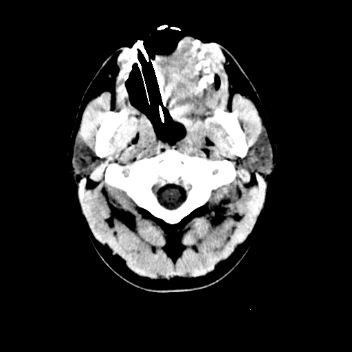

# Detecting contours of human organs in CT images using the Canny edge detector

# Abstract
We describe and implement Canny edge detector, which is widely used in medical imaging. We go through the ideas step by step and explain the theory behind it. Instead of traditional manual setting of thresholds for hysteresis, we use Otsu's thresholding algorithm. We compare the results on images from CTMRI DB. In the end we discuss the performance and suggest some further improvements.

# Results

Original image

Detected edges

Original image

Detected edges

# Instructions
- Run canny.m which takes path to image as a parameter
- Enable vizualization inside this function by setting <code>viz=0</code>
- Output image will be stored to same location as input one with "-out" suffix

# References
[1] John Canny. “A Computational Approach to Edge Detection”. In: IEEE
Transactions on Pattern Analysis and Machine Intelligence PAMI-8.6 (1986),
pp. 679–698. doi: 10.1109/TPAMI.1986.4767851.
[2] Jager Franc. EDGE DETECTION AND SEGMENTATION OF IMAGES,
I. url: https://ucilnica.fri.uni-lj.si/course/view.php?id=151/.
[3] Nobuyuki Otsu. “A Threshold Selection Method from Gray-Level His-
tograms”. In: IEEE Transactions on Systems, Man, and Cybernetics 9.1
(1979), pp. 62–66. doi: 10.1109/TSMC.1979.4310076.
[4] Alessandro Taddei et al. CT-MRI database. url: https://lbcsi.fri.
uni-lj.si/OBSS/Data/CTMRI/.
